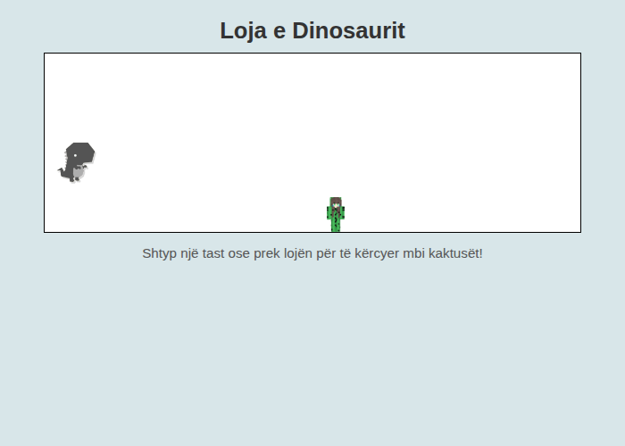

# 🦖 Loja e Dinosaurit (Dino-Game)

Created by **Erion Nezha**

**[Shqip]** | [English below](#english)

Një lojë e thjeshtë dhe klasike e dinosarit e krijuar me **HTML, CSS dhe JavaScript**. Dinosari vrapon automatikisht — detyra jote është ta kërcesh mbi kaktusët që vijnë drejt teje!

## 🎮 Si luhet

1. Hap lojën në shfletues.
2. Dinosari fillon të vrapojë vetë.
3. **Shtyp çdo tast** në tastierë për të kërcyer mbi kaktusët.
4. Nëse përplasesh me kaktusin, loja mbaron — provo përsëri!

## 🌐 Demo live

👉 **[Luaj lojën këtu](https://erionnezha.github.io/Dino-Game/)**

## 📸 Pamja e lojës

## 🛠️ Teknologjitë

- **HTML** — struktura e lojës
- **CSS** — stilimi dhe animacionet (kërcimi, lëvizja e kaktusit)
- **JavaScript** — logjika e lojës (kërcimi, detektimi i përplasjes)

## 📄 Licenca

Ky projekt është pronë ekskluzive e Erion Nezha — të gjitha të drejtat e rezervuara. Shih [LICENSE](LICENSE).

**Autori:** Erion Nezha

---

## English

A simple classic dinosaur runner game built with **HTML, CSS and JavaScript**. The dinosaur runs automatically — your job is to make it jump over the incoming cacti!

## 🎮 How to play

1. Open the game in your browser.
2. The dinosaur starts running on its own.
3. **Press any key** on your keyboard to jump over the cacti.
4. If you hit a cactus, the game is over — try again!

## 🌐 Live demo

👉 **[Play the game here](https://erionnezha.github.io/Dino-Game/)**

## 📸 Screenshot

## 🛠️ Technologies

- **HTML** — game structure
- **CSS** — styling and animations (jump, cactus movement)
- **JavaScript** — game logic (jumping, collision detection)

## 📄 License

This project is the exclusive property of Erion Nezha — all rights reserved. See [LICENSE](LICENSE).

**Author:** Erion Nezha
